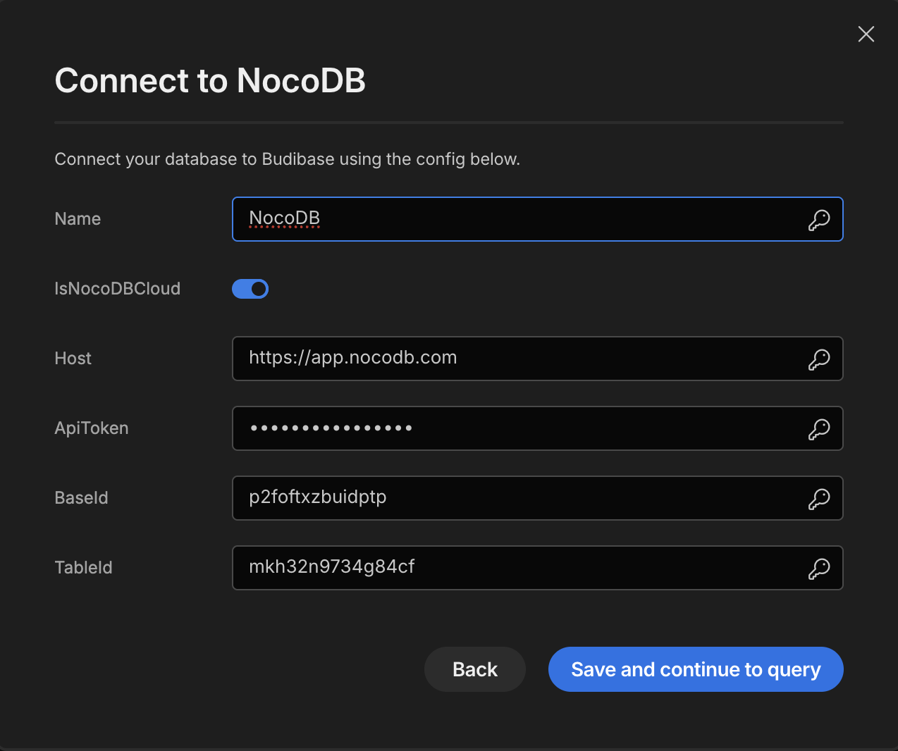

# Budibase datasource plugin - NocoDB table
This is a Budibase plugin to use NocoDB table as Budibase datasource.

# Introduction

[Budibase](https://github.com/Budibase/budibase) is an open-source workflow platform that saves engineers time and energy building apps that integrate with any data source and speed-up any process.

[NocoDB](https://nocodb.com) is an a no code database platform that allows business users to create applications without code and in the form spreadsheet.

This is Budibase datasource plugin to use NocoDB table as Budibase datasource.

# Setting NocoDB Data Source

There are some parameters required to add NocoDB table as data source:

* `IsNocoDbCloud`: Set to true if the NocoDB instance is on `https://app.nocodb.com`, otherwise false.
* `Host`: Url to your NocoDB instance. If it's set to empty, it'll be set to cloud NocoDB at `https://app.nocodb.com`
* `ApiToken`: Api token of your account in NocoDB. See [here](https://nocodb.com/docs/product-docs/account-settings/api-tokens) on how to obtain your NocoDB ApiToken.
* `BaseId`: Your NocoDB base id where the table will be used in query. The base id format should be similar with `piols8u9c10b210`.
* `TableId`: Your NocoDB table id to be used in query. The table id format should be similar with `mwi4dei58h1ezte`.
